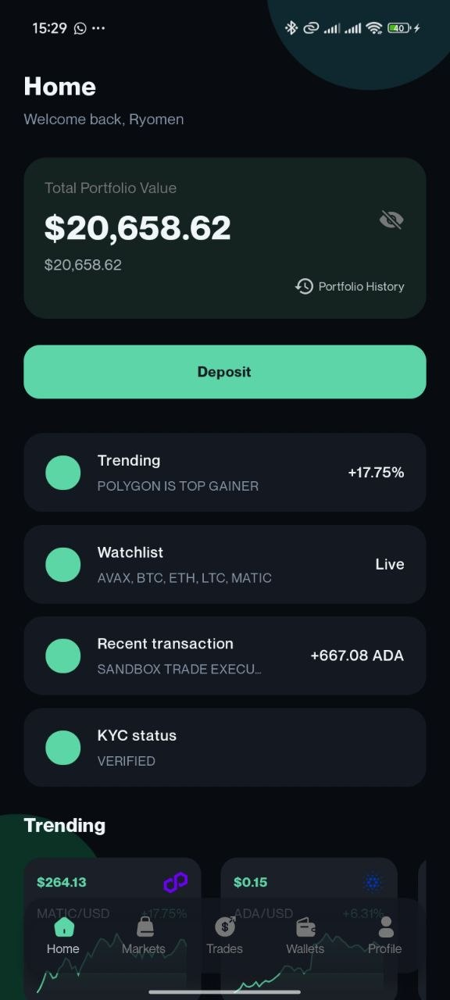
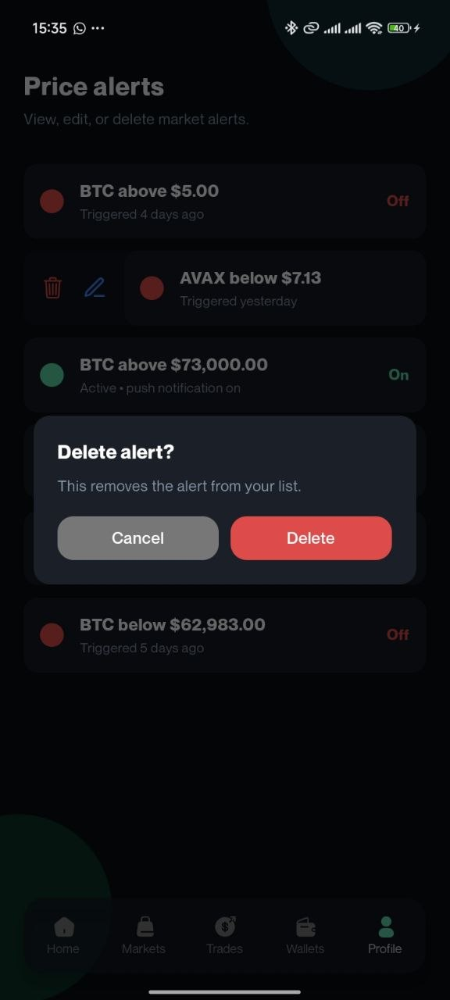
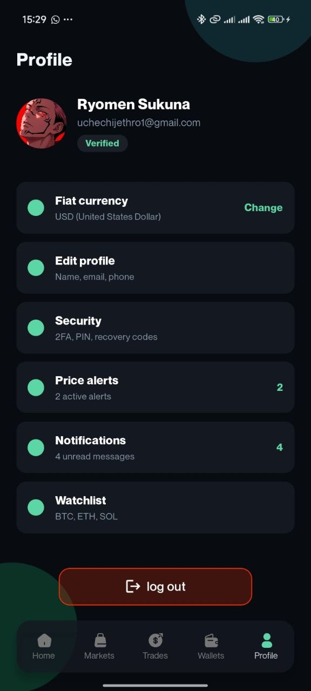
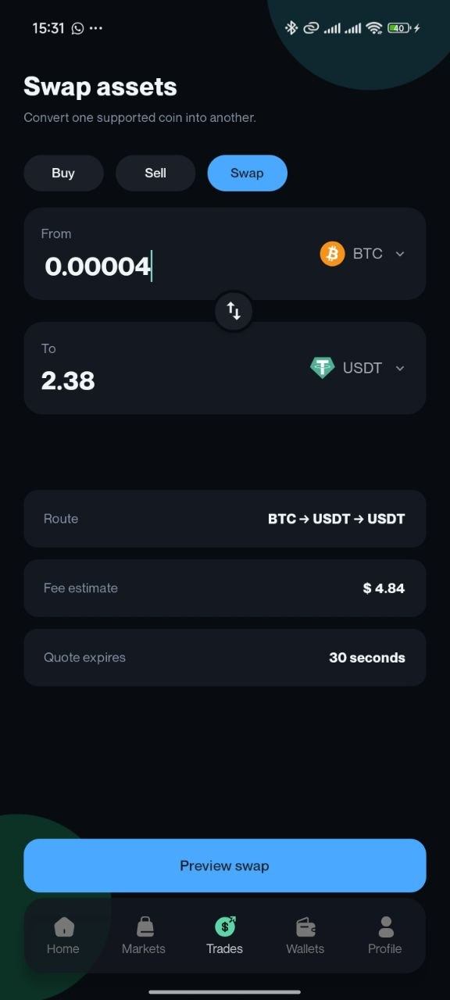
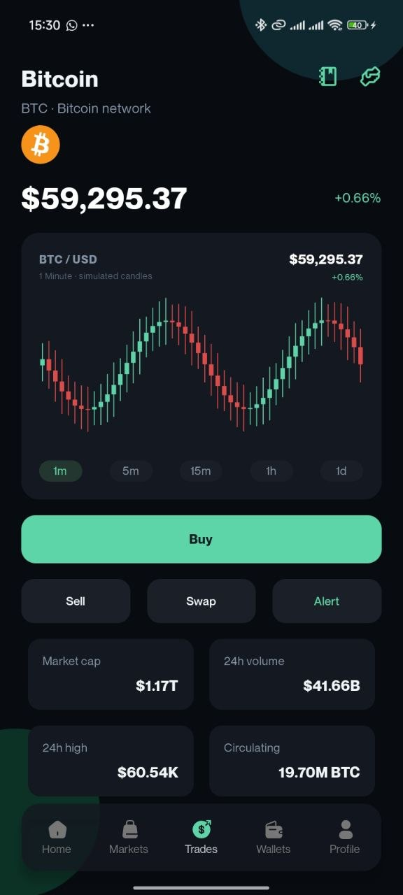
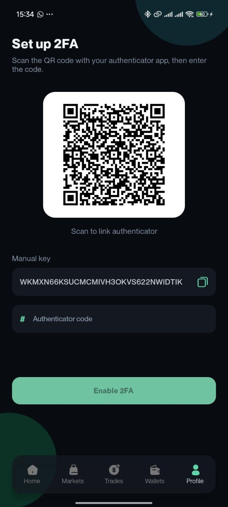
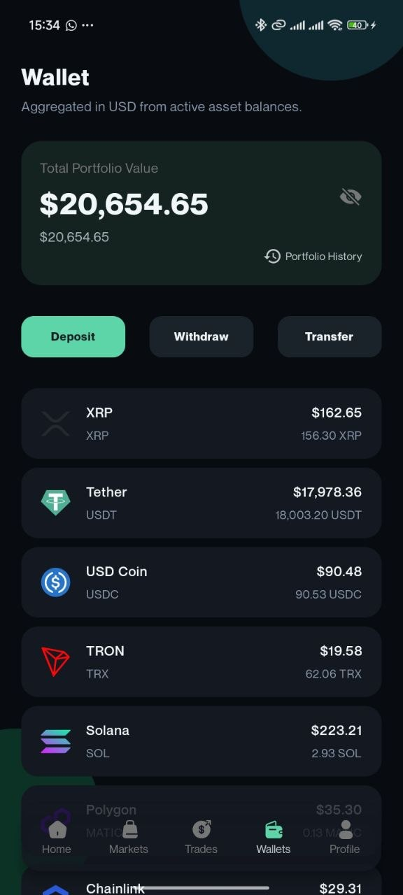
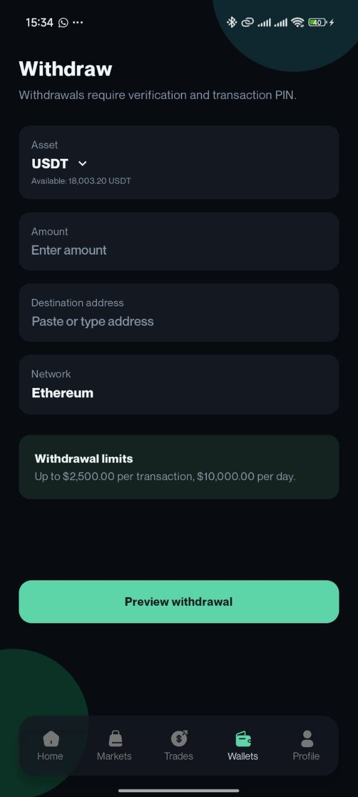

# 🌟 tMinus1

**tMinus1** is a comprehensive mobile application designed to manage cryptocurrency transactions, wallets, and user profiles. It provides a secure and user-friendly interface for users to interact with various cryptocurrencies, including Bitcoin, Ethereum, and more.

## 🚀 Features

* **Transaction Management**: Seamlessly send, receive, and manage cryptocurrency transactions.
* **Wallet Creation**: Create and manage multiple wallets for different cryptocurrencies.
* **Profile Management**: A comprehensive system for user information, settings, and verification status.
* **Inactivity Lock**: Integrated session security that automatically locks the app after periods of inactivity.
* **Secure Storage**: Advanced protection for sensitive data, including private keys and wallet information.

## 🛠️ Tech Stack

* **Frontend**: React Native, Expo
* **Backend**: Node.js, Express.js (Developed by [chinonsogreat7](https://github.com/chinonsogreat7))
* **Database**: MongoDB
* **API**: RESTful API
* **Security**: SSL/TLS, Secure Storage

## 📦 Installation

To install and run **tMinus1** locally, follow these steps:

1. **Clone the repository:**
```bash
git clone https://github.com/Jay-Tiroh/tMinus1.git
cd tMinus1

```


2. **Install dependencies:**
```bash
npm install # or yarn install

```


3. **Start the application:**
```bash
npm start # or yarn start

```


## 📂 Project Structure

```text
.
├── app.config.ts
├── src
│   ├── components
│   │   ├── InactivityLockProvider.tsx
│   │   └── ...
│   ├── constants
│   │   ├── MenuLists.ts
│   │   ├── Coins.ts
│   │   ├── AssetsMap.ts
│   │   └── ...
│   ├── helpers
│   │   ├── functions.ts
│   │   └── ...
│   ├── hooks
│   │   ├── useWallet.tsx
│   │   ├── useMarket.tsx
│   │   ├── useTradeCalculator.tsx
│   │   ├── useTransactionById.tsx
│   │   ├── useTransactions.tsx
│   │   ├── useUser.tsx
│   │   ├── useProfile.tsx
│   │   └── ...
│   ├── store
│   │   ├── services
│   │   │   ├── walletsApi.ts
│   │   │   ├── profileApi.ts
│   │   │   └── ...
│   │   ├── slices
│   │   │   ├── authSlice.ts
│   │   │   └── ...
│   │   └── ...
│   └── ...
├── package.json
└── ...

```

## 📸 Screenshots

| Home | Price Alerts | Profile |
| :---: | :---: | :---: |
|  |  |  |

| Swap | Trade | 2FA Setup |
| :---: | :---: | :---: |
|  |  |  |

| Wallets | Withdrawal |
| :---: | :---: |
|  |  |
